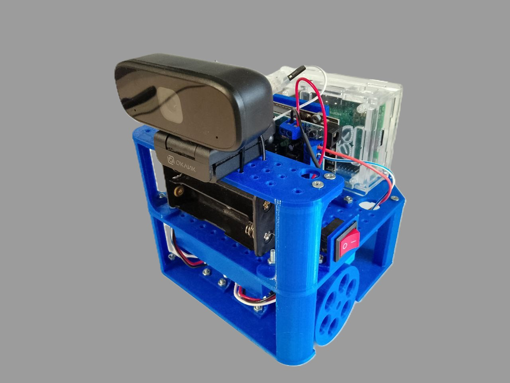

# ProtoRover
# Robot project for practicing fundamental robotics concepts

  

## Описание проекта

Робот, созданный для отработки основных робототехнических концептов: например, PID, OpenCV, ROS. 

Задача в рамках проекта заключается в следующем:
  -реализация нижнего уровня, общающегося по протоколу UART с верхним уровнем и выполняющим команды о перемещении на определённое расстояние и поддержание заданных линейной и угловых скоростей.
  -реализация верхнего уровня, обрабатывающего изображение с камеры, определяющего цель, за которой необходимо двигаться и передающего данные о передвижении на нижний уровень

## Технические детали

- **Основные компоненты**:

  
- **Программное обеспечение**:

## Инструкция по запуску

## Авторы

Если у вас есть вопросы или предложения по улучшению проекта, пожалуйста, свяжитесь с нами!

---
